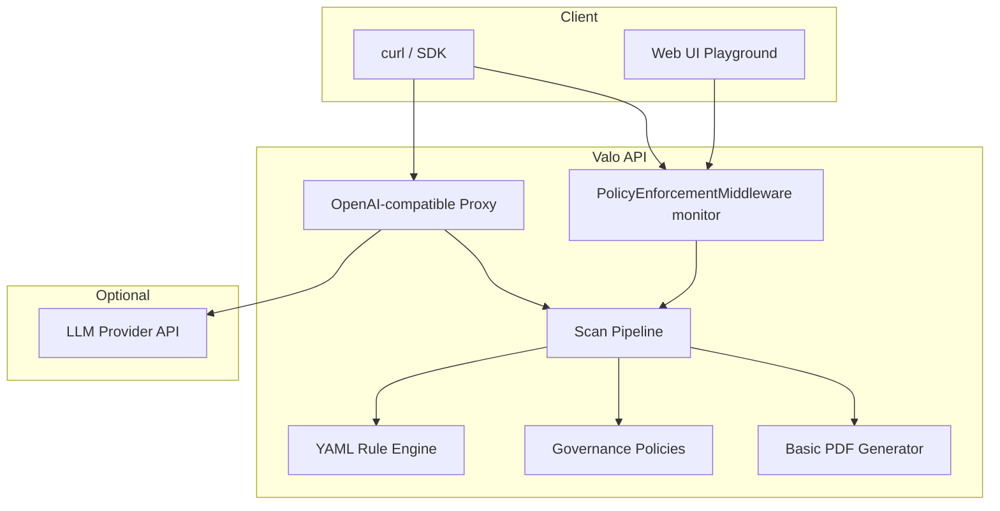

# Valo Community Edition architecture

## Components



## Request flow: POST /analyze

1. Client sends `PipelineRequest` (`target`, `prompt`, optional `metadata`).
2. `PolicyEnforcementMiddleware` evaluates governance policies in **monitor**
   mode (headers only, no blocking).
3. `run_pipeline` loads YAML rules, runs text-scan + context engines, computes
   deterministic score.
4. Policy engine returns `allow`, `warn`, or `deny` decision on the response.
5. Result is returned as `AnalyzeResponse` with embedded `ScanReport`.

## Request flow: POST /v1/proxy/chat/completions

1. OpenAI-compatible client points `base_url` at Valo.
2. Proxy extracts the user prompt, runs the same pipeline + policies.
3. In monitor mode, denied prompts are logged but forwarded upstream.
4. Response is streamed or returned from the configured upstream URL.

## Capability scope

Community Edition exposes core analysis, policy, and proxy routes. The following
are not available in this release:

- `/executive`, `/reports`, `/playbooks`, `/learning`, `/outcomes`
- `/portfolio/*` and portfolio rollup PDF export
- `APP_ENFORCEMENT_MODE=enforce` (startup validation rejects enforce mode)

`GET /meta/edition` returns the active edition and feature flags.

## Deployment

```bash
docker compose up --build
```

- API: http://localhost:8000 (Swagger at `/docs`)
- Web: http://localhost:8080
